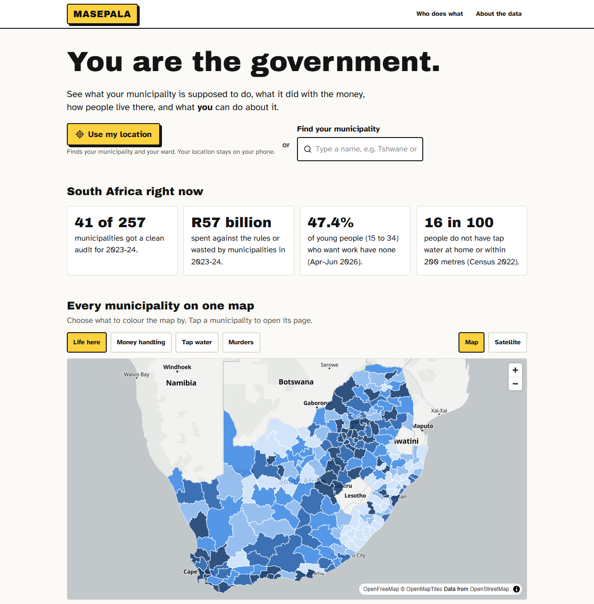
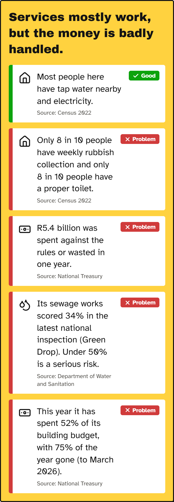
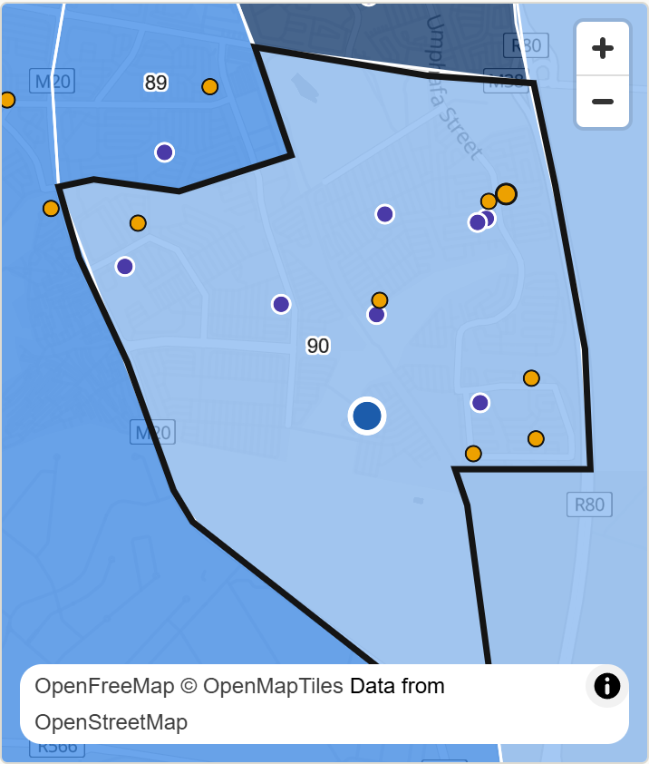
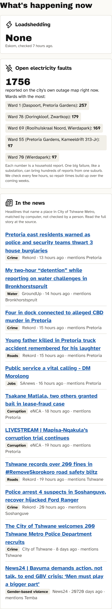
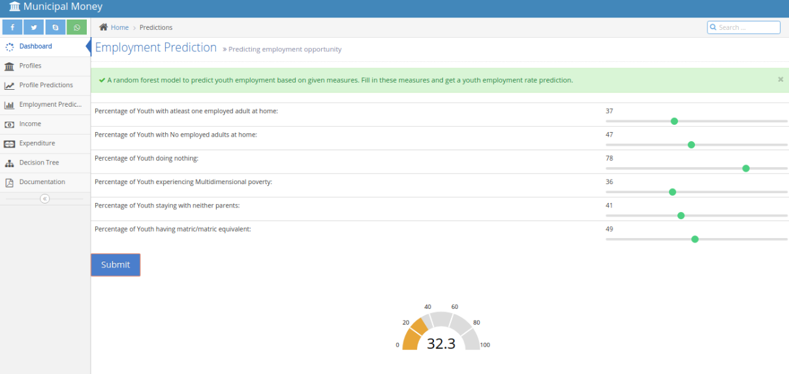
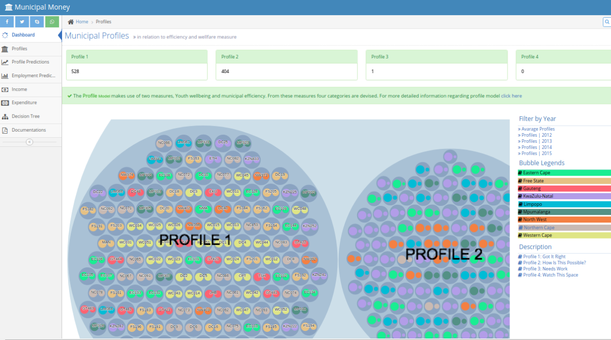
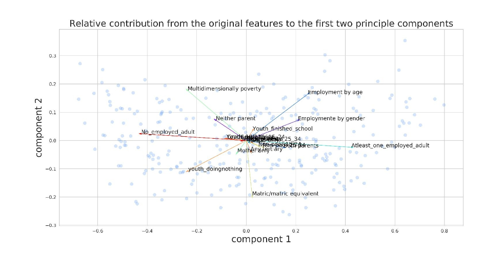

# Masepala

**Know your municipality.** A plain-language, visual site about every South
African municipality and ward: what it is supposed to do, what it did with the
money, how people live there, how safe it is, what is happening right now, and
what an ordinary resident can do about it.

**Live: [masepala.vercel.app](https://masepala.vercel.app)** · Part of [Ubunye AI Ecosystems](https://github.com/ubunye-ai-ecosystems), built on the [Ubunye Engine](https://github.com/ubunye-ai-ecosystems/ubunye_engine).

"You are the government. This is your information."

<p align="center">
  
</p>

<p align="center">
  
  
  
</p>

## What a resident sees

- **The story first.** Every municipality page opens with a one-line verdict and
  at most five plain sentences, each marked good or problem, with its source.
  They are written by fixed rules from the numbers, never by AI.
- **Use my location.** One tap finds your municipality and your ward (the ward
  polygon your location falls in). The location never leaves the phone.
- **What's happening now**, refreshed about every hour: Eskom's loadshedding
  stage, the City of Tshwane's open electricity faults, and local news headlines.
- **The money**: this year so far against time gone, planned against spent,
  who owes the municipality and what it owes Eskom, grants used, audit history.
- **How people live**: water, toilets, electricity, rubbish, housing, schools and
  matric results, formal jobs and pay, safety per police station.
- **Every ward**: its councillor, how it voted in 2024, its schools and faults,
  on a map or satellite view.
- **What you can do**: action cards chosen from that municipality's own
  problems, with official free numbers and the April to May budget window.

## How it works

```
~25 public sources ──► engine/  (Ubunye Engine pipelines: run, then stop)
                         ├─ municipal: quarterly, 6 tasks ──► web/data/*.json ──► Vercel rebuilds the static site
                         └─ live: hourly, 1 task ───────────► live-data branch ──► the site reads it directly
```

Nothing runs between refreshes: no server, no database, and it costs nothing.

### engine/ on the Ubunye Engine

The data layer is built on the [Ubunye Engine](https://github.com/ubunye-ai-ecosystems/ubunye_engine)
with its pandas backend. Each task in `engine/pipelines/dside/` is a
`config.yaml` (inputs and outputs) plus a small `Task` class. Every public
source is an Ubunye reader plugin registered in `engine/pyproject.toml`, so a
task can simply say `format: treasury_cube` or `format: dside_source, name: schools`.

| Task | What it does |
|---|---|
| `01_ingest_money` | Treasury budgets, spending, building spending, wasted money, audits |
| `02_ingest_people` | Census 2022, Youth Explorer, SAPS crime per station, Stats SA labour force |
| `03_ingest_places` | Municipal and ward boundaries, ward profiles, government projects |
| `03b_ingest_fresh` | 18 newer sources: this year's Treasury figures, 2025 tax jobs, 2026 population, schools, matric, elections, water quality, SIU |
| `04_analyse` | Scores, comparisons, the story, the audit model, everything placed on the map |
| `05_publish` | The JSON files the site reads |
| `live/01_collect` | Tshwane faults (remembered between runs), civic news, Eskom stage |

The analysis lives in `engine/dside_engine/analytics/`. There is one small
predictive model (next year's audit outcome, published only because it beats a
"same as last year" guess on a year it never saw); everything else is
descriptive, statistical or rule based. Clustering was tried and rejected
because municipalities do not form real groups. The site's About page explains
every method and every limit.

### What the Ubunye Engine checks on every run

- **Before the run:** `ubunye doctor` and `ubunye plan` check the machine and
  every task (the pull request checks run them too).
- **Before anything is written:** each task declares `CONFIG.expectations`
  (at least 4,000 wards, one row per ward, shares between 0 and 1, audit
  opinions the model knows). A broken `fail` rule stops the run; unknown audit
  opinions are set aside in `audits_quarantine`; `warn` rules are reported.
- **After the run:** every task leaves a run record (row counts, data hashes,
  input and code hashes, every expectation). `dside_engine/health.py` gates
  this run against the last one with the engine's gate (a table that moves by
  more than 25% fails), and writes `/status`. On a failure the site keeps the
  old data and a `data-health` issue is opened.
- **The audit model** is an `UbunyeModel` in the Ubunye model registry. Each
  quarter's version is registered with its test scores and promoted only if it
  passes the promotion gates: it beats "same as last year" and does no worse
  than the live version. Every live prediction is scored once the real audit
  outcome is published (`dside_engine/analytics/audit_registry.py`).

The registry, the run records (also as OpenLineage events) and the monitoring
history live on the single-commit `registry` branch.

### When a source fails

Every download goes through one client (`dside_engine/http.py`). A host that
stops answering is marked down after three failures, so its sources fall back
to their last good copy (the `snapshots` branch) in seconds. A fetch that
returns less than half the rows of the last good copy counts as a failure too.

SASSA and the Department of Water and Sanitation only answer South African
addresses, so GitHub's own machines (in the United States and Europe) cannot
reach them. A machine in South Africa, registered as a self-hosted GitHub
runner, fetches just those two every Monday (`za-sources.yml`, set up with
`za-runner/`); the quarterly run uses its copies. No cloud account is involved.

## Sources

National Treasury (Municipal Money), Stats SA (Census
2022, labour force survey, 2026 population estimates), Youth Explorer and
Wazimap (OpenUp), SAPS crime statistics, Municipal Demarcation Board wards,
Vulekamali projects, the Spatial Tax Panel (SARS, National Treasury, HSRC),
SASSA, the Department of Water and Sanitation, the Department of Basic
Education, election results (IEC via SANEF's Wazimap), the Gauteng City-Region
Observatory, the SIU, the City of Tshwane outage map, Eskom, and South African
news feeds (headlines and links only). Maps: OpenFreeMap and Esri World Imagery.

## Run it

```bash
cd engine
pip install -e ".[test]"
pytest -q tests
./run.sh              # the quarterly pipeline; REFRESH=true ignores the download cache
./run_live.sh         # the live pipeline
cd ../web && npm install && npm run build   # static site in web/out
```

Three GitHub workflows: `refresh-data.yml` (quarterly: checks, runs, gates,
commits `web/data` when healthy, Vercel rebuilds), `refresh-live.yml` (every
hour, publishes to the single-commit `live-data` branch) and
`checks.yml` (every pull request: tests, `ubunye validate`, `doctor` and
`plan`, and a site build).

## History

This repository began in 2017 as DSIDE, a Municipal Money analysis with
notebooks and a Django dashboard. The notebooks and data are kept below for
history. The Django dashboard and an unfinished 2026 attempt were removed from
the tree in September 2026 and are preserved in full at the `legacy-2017` tag.

---

# DSIDE - Municipal Money (2017)


<p align="center">
   
  
</p>

<p align="center">
  
</p>


The project was aimed towards aiding municipalities of South Africa to better measure their performance 
in terms of Service Delivery and Efficiency. We achieved this through the creation 
of a *profiling measure*. Furthermore we investigated which youth characteristics are
associated with *youth unemployment*. An extensive tool was developed in the form of a dashboard, 
where the results and real time predictions of the developed models can be viewed.


- We used several machine learning techiques:

* Principal Componet Analysis (PCA): to find the features which affect youth employment.
* Decision Tree and Random Forests : to predictions the probability of youth getting employed given the characteristics of their municipality.
* Support Vector Machines (SVM)    : to predict the profile of the municipality.

- Outputs to the projects:

* [Infographic](https://create.piktochart.com/output/27061299-municipal-money)

* [Presentation](https://prezi.com/view/DltmNuhuwJH3mcKxkPEH/)

- Here is the Link to the data source:

* [Municipal Money Data](https://municipalmoney.gov.za/)
